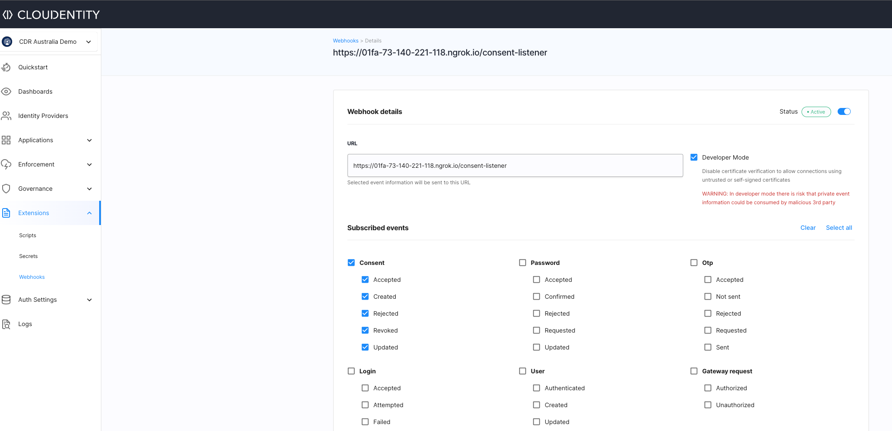

## Event listener app

### Run the app

* npm install
* npm start

### Expose through ngrok

* Install [ngrok](https://ngrok.com/) if you have not already
* Route the traffic through ngrok to localhost 3000
    `ngrok http 3000`

Now you should see a publicly accessible route that can be accessed from Cloudentity SaaS

```

Session Status                online

..
Version                       2.2.8
Region                        United States (us)
Web Interface                 http://127.0.0.1:4040
Forwarding                    http://01fa-73-140-221-118.ngrok.io -> localhost:3000
Forwarding                    https://01fa-73-140-221-118.ngrok.io -> localhost:3000
```

Make a note of the https URL

### Configure Cloudentity webhooks

* Login into Cloudentity SaaS tenant and choose a workspace
* Choose extensions & [create webhooks](https://cloudentity.com/developers/howtos/extensions/webhooks/#create-a-webhook-for-event-based-notifications)
* Provide above URL exposed via `ngrok` and choose `Consent` related events for this application

> NOTE: This webhook is configured to listen to Consent events in a CDR workspace



### Run workflow that generates Consents

* Use the financroo app in the quickstart guides to start CDR flow
    * this one generates consents
* Use the self service app to revoke consents

.Sample input to webhooks for `Consent` related actions
```json
{
	"audit_events": [{
			"tenant_id": "pi314",
			"server_id": "cdr_australia-demo-tcbq4jjooo",
			"event_id": "f2cda08c72f54cd39752563066bc0e70",
			"timestamp": "2022-10-19T20:41:54.46689971Z",
			"context": null,
			"event_subject": "consent",
			"action": "created",
			"metadata": {
				"ip": "73.140.221.118",
				"client_id": "bugkgm23g9kregtu051g",
				"user_agent": "Mozilla/5.0 (Macintosh; Intel Mac OS X 10_15_6) AppleWebKit/537.36 (KHTML, like Gecko) Chrome/106.0.0.0 Safari/537.36",
				"trace_id": "0217352cd32e5df30e769f1bac0abf74"
			},
			"payload": {
				"consent_created": {
					"consent": {
						"id": "94e61bf7b72f44fd8996bee7437662fe",
						"type": "cdr_arrangement",
						"details": {
							"cdr": {
								"tenant_id": "pi314",
								"authorization_server_id": "cdr_australia-demo-tcbq4jjooo",
								"client_id": "bugkgm23g9kregtu051g",
								"subject": "user",
								"cdr_arrangement_id": "94e61bf7b72f44fd8996bee7437662fe",
								"status": "AwaitingAuthorisation",
								"expiry": "2022-10-19T20:51:54.271033513Z",
								"created_at": "2022-10-19T20:41:54.271033513Z",
								"updated_at": "2022-10-19T20:41:54.271033513Z",
								"sharing_type": "one_time",
								"spec_version": "v1",
								"customer_id": "bfb689fb-7745-45b9-bbaa-b21e00072447",
								"cdr_arrangement_metadata": {}
							}
						}
					}
				}
			}
		},
		{
			"tenant_id": "pi314",
			"server_id": "cdr_australia-demo-tcbq4jjooo",
			"event_id": "55423b7717a847038a1f589b5c065cbd",
			"timestamp": "2022-10-19T20:44:03.202213701Z",
			"context": null,
			"event_subject": "consent",
			"action": "accepted",
			"metadata": {
				"ip": "73.140.221.118",
				"client_id": "bv0ocudfotn6edhsiu7g",
				"subject": "bv0ocudfotn6edhsiu7g",
				"user_agent": "Go-http-client/1.1",
				"session_id": "237bac2608de4a9d9ee57b65b86d7950",
				"trace_id": "36106a57522edb2ed09191111cf02b52"
			},
			"payload": {
				"consent_accepted": {
					"consent": {
						"id": "94e61bf7b72f44fd8996bee7437662fe",
						"type": "cdr_arrangement",
						"details": {
							"cdr": {
								"tenant_id": "pi314",
								"authorization_server_id": "cdr_australia-demo-tcbq4jjooo",
								"client_id": "bugkgm23g9kregtu051g",
								"subject": "user",
								"cdr_arrangement_id": "94e61bf7b72f44fd8996bee7437662fe",
								"status": "Authorised",
								"expiry": "2022-10-19T20:51:54.271033Z",
								"created_at": "2022-10-19T20:41:54.271033Z",
								"updated_at": "2022-10-19T20:41:54.271033Z",
								"sharing_type": "one_time",
								"spec_version": "v1",
								"account_ids": [
									"1000001",
									"1000002",
									"96534987"
								],
								"customer_id": "bfb689fb-7745-45b9-bbaa-b21e00072447",
								"cdr_arrangement_metadata": {}
							}
						}
					}
				}
			}
		}
	]
}
```

You should see the local node application receiving audit events related to Consent actions. There is an endpoint exposed in the node app that aggregates
the consent information per arrangement_id

```sh
curl --location --request GET 'https://01fa-73-140-221-118.ngrok.io/consent-events'
```

.Sample processed output arranged by `cdr arrangement id`
```json
{
    "02e0d6528944416c9c9909fda3e1fef9": [
        {
            "consent_action": "created",
            "consent_status": "AwaitingAuthorisation",
            "consent_updatedAt": "2022-10-19T22:24:25.950279628Z",
            "consent_expiry": "2022-10-19T22:34:25.950279628Z"
        },
        {
            "consent_action": "accepted",
            "consent_status": "Authorised",
            "consent_updatedAt": "2022-10-19T22:24:25.950279Z",
            "consent_expiry": "2022-10-19T22:34:25.950279Z"
        },
        {
            "consent_action": "revoked",
            "consent_status": "Authorised",
            "consent_updatedAt": "2022-10-19T22:24:25.950279Z",
            "consent_expiry": "2022-10-19T22:34:25.950279Z"
        }
    ]
}
```

## Taking it further

Now you can extend it further to stream it to Kafka for durability and distributing to other systems for consumption.

